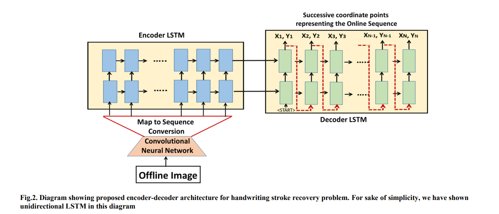

# Handwriting-Trajectory-Recovery
Handwriting Trajectory Recovery using End-to-End Deep Encoder-Decoder Network, ICPR 2018. 

## Architecture


## Citation

If you find this article useful in your research, please consider citing: 
```
@inproceedings{bhunia2018handwriting,
  title={Handwriting trajectory recovery using end-to-end deep encoder-decoder network},
  author={Bhunia, Ayan Kumar and Bhowmick, Abir and Bhunia, Ankan Kumar and Konwer, Aishik and Banerjee, Prithaj and Roy, Partha Pratim and Pal, Umapada},
  booktitle={2018 24th International Conference on Pattern Recognition (ICPR)},
  pages={3639--3644},
  year={2018},
  organization={IEEE}
}
```
